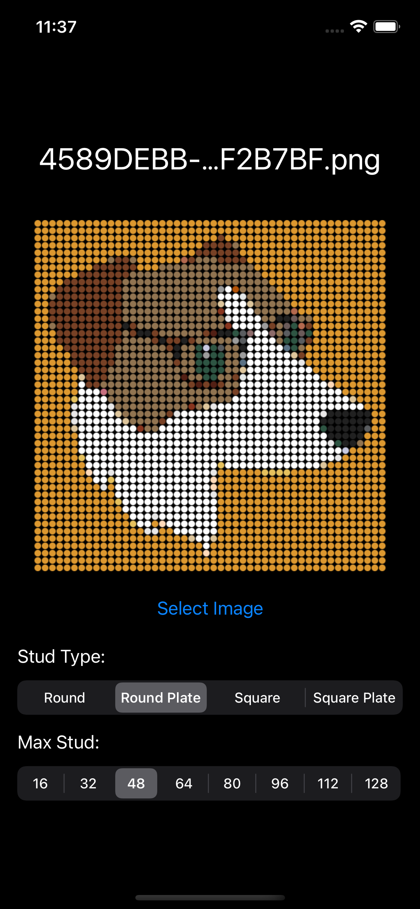
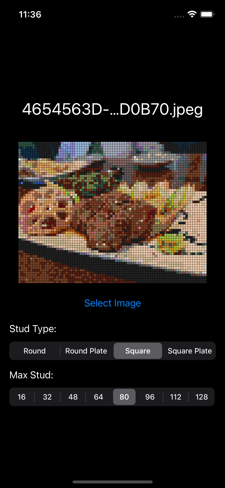
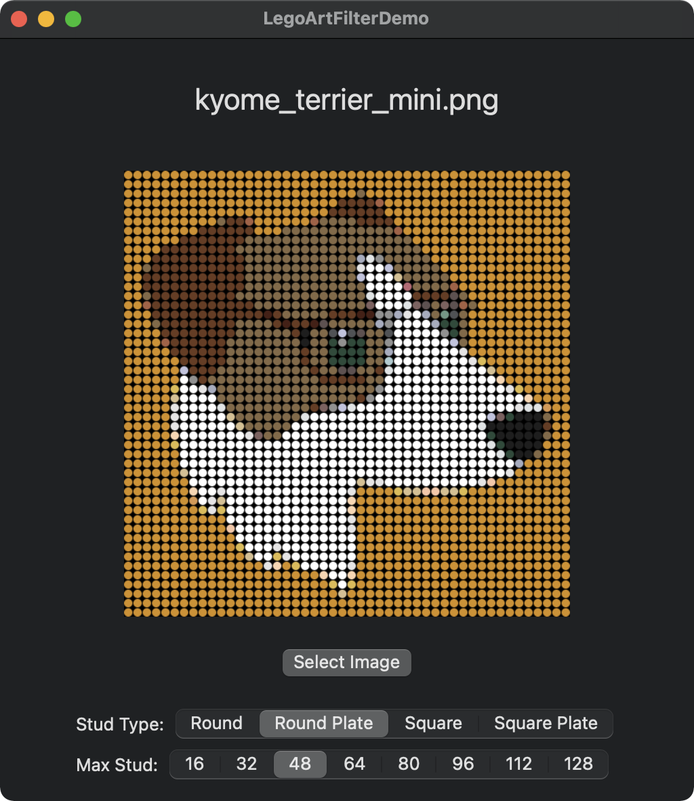
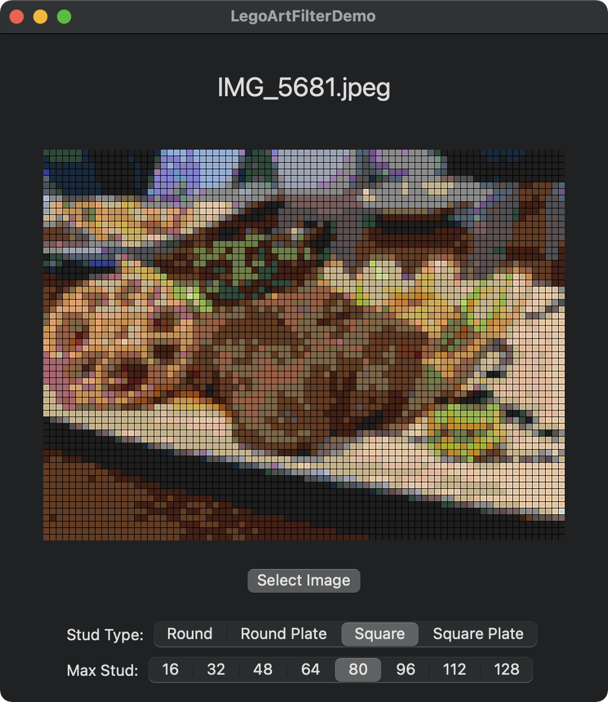

# LegoArtFilterDemo

Demonstration of LegoArtFilter for iOS/macOS. 
This project runs on both iOS (14≤) and macOS (11≤).

## Libraries

- [LegoColors](https://github.com/Kyome22/LegoColors)
- [LegoArtFilter](https://github.com/Kyome22/LegoArtFilter)

## ScreenShot

### iOS

 

### macOS

 

## LICENSE

Copyright (c) 2021 Takuto NAKAMURA (Kyome)

You are free to use it as long as it is not for commercial use.
